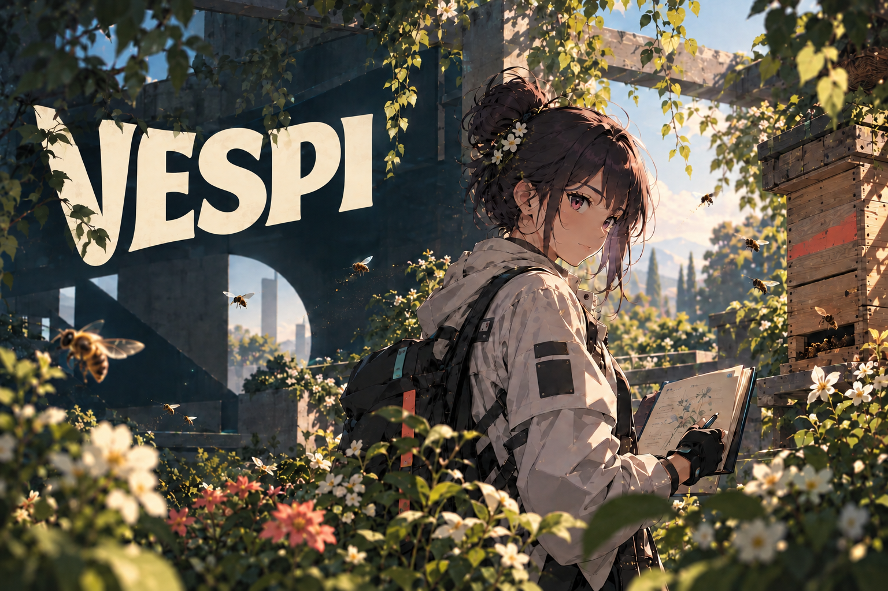

# Vespi

  
  

[Read in English](./README.md)

Vespi es un pequeño experimento público sobre cómo personas, modelos y servicios pueden trabajar juntos sin compartir automáticamente el mismo contexto ni los mismos permisos.

Lo construye en público **Andrés Peña Mellado**.

Este repositorio empieza temprano a propósito. Vespi todavía no es un runtime terminado ni un protocolo estable. Lo que existe hoy es un génesis público: una pregunta, una manera provisional de pensar las operaciones y un lugar donde experimentos, errores y cambios de dirección puedan quedar visibles mientras ocurren.

## Qué existe hoy

- [`v0.0.1-genesis`](https://github.com/andresanemic/vespi/releases/tag/v0.0.1-genesis), el primer corte público.
- [`docs/GENESIS.md`](./docs/GENESIS.md), con el problema actual, las tesis de trabajo y aquello que todavía no afirmamos.
- [`experiments/`](./experiments/), el lugar público para las corridas. El primer andamiaje existe, pero todavía no se afirma ninguna corrida completada.
- Una primera dirección sobre Stellar testnet, todavía en desarrollo y no presentada como una capability ya publicada.

> **La unidad no es el agente. La unidad es la operación.**\
> *Tesis de trabajo.*

## De dónde viene

Vespi nace del trabajo de **Andrés Peña Mellado** en **LUS** y **Lore Plugin**, pero es un proyecto separado, con su propia historia.

**LUS** estudia cómo el trabajo compartido entre humano e IA puede convertirse en criterio reutilizable que modifica decisiones posteriores.

**Lore Plugin** vuelve ese criterio acumulado utilizable entre proyectos, bots y modelos.

Vespi hace otra pregunta: ¿qué ocurre cuando participantes distintos necesitan coordinarse sin compartir automáticamente el mismo contexto, permisos o historia?

La relación importa, pero también sus fronteras. El trabajo de colaboradores o proyectos vecinos no se convierte en input de Vespi por proximidad. La frontera de procedencia vigente está registrada en [`GENESIS.md`](./docs/GENESIS.md).

## ¿Por qué publicarlo tan temprano?

Porque la historia también es evidencia.

Vespi no debería aparecer después con un relato de origen perfecto. Lo que sobreviva, lo que falle, lo que cambie y lo que sea rechazado debería quedar inspeccionable mientras el proyecto todavía se está convirtiendo en sí mismo.

## Autor

**Andrés Peña Mellado**\
Digital Art Director & Creative Developer trabajando entre agentes de IA, Web3, diseño e investigación.

 &nbsp;&nbsp; [<picture><source media="(prefers-color-scheme: dark)" srcset="./assets/icons/v2/x-dark.svg"></picture>](https://x.com/andresanemic) &nbsp;&nbsp;  &nbsp;&nbsp; 

---

[Génesis](./docs/GENESIS.md) · [Changelog](./CHANGELOG.md) · [Experimentos](./experiments/) · [Release v0.0.1-genesis](https://github.com/andresanemic/vespi/releases/tag/v0.0.1-genesis) · [Licencia MIT](./LICENSE)
